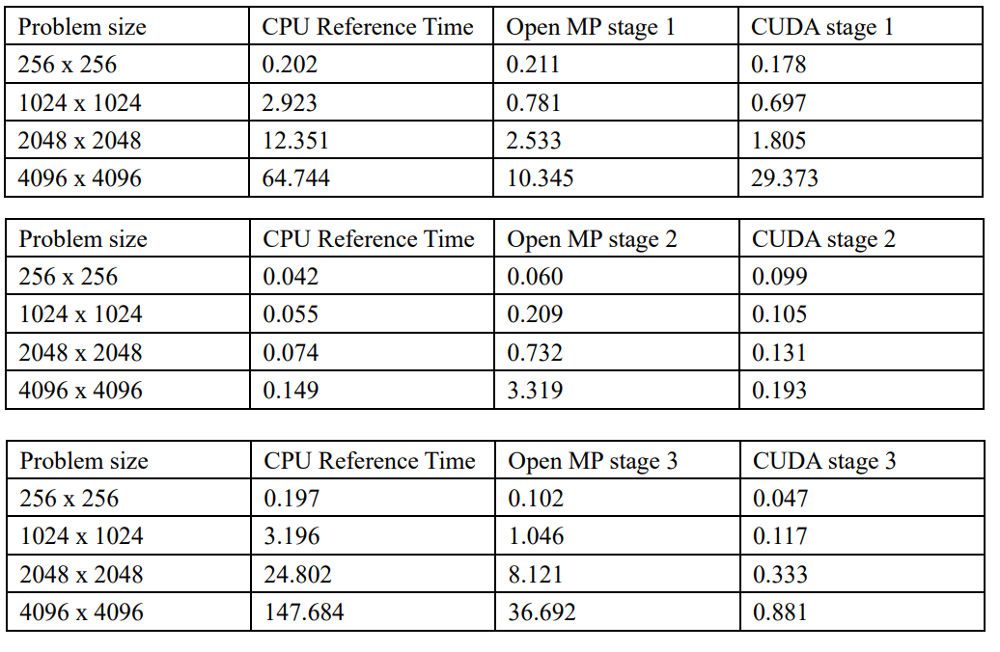

# Image Masiac with CUDA and OpenMP
This is a pure C implementation of image mosaic compared with CPU, OpenMP and CUDA acceleration. The input image can be png or jpg files witch shown im samples.

# Results of speed comparision


The input image can be any size jpg and png file such as below:  
Source image from wallpaper here:


After masic:


## Dependency
- C compiler
- OpenMP support
- Nvidia GPU and CUDA, optional


## Usage
Download the repository and change directory to the workspace
```sh
git clone [https://github.com/Qinzhizhou/Image-Masaic-Process-CUDA-OpenMP.git](https://github.com/Qinzhizhou/Image-Masaic-Process-CUDA-OpenMP.git)
cd Image-Masaic-Process-CUDA-OpenMP
```

If there is no Nvidia GPU on your device, checkout to openmp branch

```sh
git checkout openmp
```
Executable with build the project in Visual studio  with argument 

```sh
mosaic M -i input_file -o output_file 
where:
        M              Is the mode with a value of either CPU, OPENMP OR CUDA. 
                       The mode specifies which version of the simulation
                       code should execute. 
        -i input_file  Specifies an input image file
        -o output_file Specifies an output image file which will be used
                       to write the mosaic image

```

